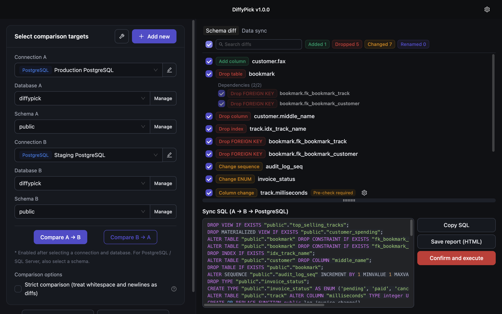

  <picture>
    <source media="(prefers-color-scheme: dark)" srcset="assets/logo-dark.png">
    
  </picture>

  <strong>See exactly what changed in your database — even when you forgot.</strong>

  Visual schema diff &amp; sync for MySQL, MariaDB, PostgreSQL, SQL Server and SQLite.

  <a href="https://diffy-pick.com/"><strong>diffy-pick.com</strong></a> ·
  <a href="../../releases/latest">Download latest</a> ·
  <a href="README_ja.md">日本語</a>

---

## What is DiffyPick?

DiffyPick is a desktop app that compares two databases, shows every difference as a color-coded, per-object list, and syncs them safely — with FK-aware ordering, preflight checks, generated SQL preview and one-click backup. Local vs. staging vs. production, or across dialects (e.g. MySQL → PostgreSQL), all from one window.

- **Databases**: MySQL, MariaDB, PostgreSQL, SQL Server, SQLite
- **Platforms**: macOS, Windows (Linux planned)
- **Cross-DBMS**: compare and migrate structures between any two dialects
- **Safe by design**: fail-closed guardrails, statement-level execution, backup & restore
- **Local & offline**: nothing leaves your machine except license verification and update checks

  

For features, pricing, FAQ and demo video, see the landing page: **[diffy-pick.com](https://diffy-pick.com/)**.

## This repository

This is the **release distribution** repository for DiffyPick. It hosts:

- **Release binaries** for macOS, Windows (and future platforms) — see the [Releases](../../releases) page.
- **The auto-update feed** the app checks at startup.

DiffyPick itself is a **closed-source commercial application** — the source code is not published here or anywhere else.

### About the "Source code (zip/tar.gz)" links on release pages

GitHub automatically attaches "Source code" archives to every release. Those archives contain **only this repository's contents** (essentially this README) — **not** the DiffyPick application source. To install DiffyPick, download the binary assets attached to each release (`DiffyPick-*.dmg`, `DiffyPick-*.exe`, `DiffyPick-*.AppImage`, etc.).

## Install

1. Open the [latest release](../../releases/latest).
2. Download the asset for your OS:
   - **macOS**: `DiffyPick-*.dmg`
   - **Windows**: `DiffyPick-*.exe`
3. Open the installer and follow the prompts. SQLite works for free with no account or time limit — add the other engines when you are ready.

Updates are checked at launch and only applied when you choose — DiffyPick never updates itself in the background.

## Support &amp; feedback

Bug reports, feature requests and licensing questions: **support@eggletric.com**

## Links

- **Product site**: <https://diffy-pick.com/>
- **Made by Eggletric**: <https://eggletric.com/>

  

