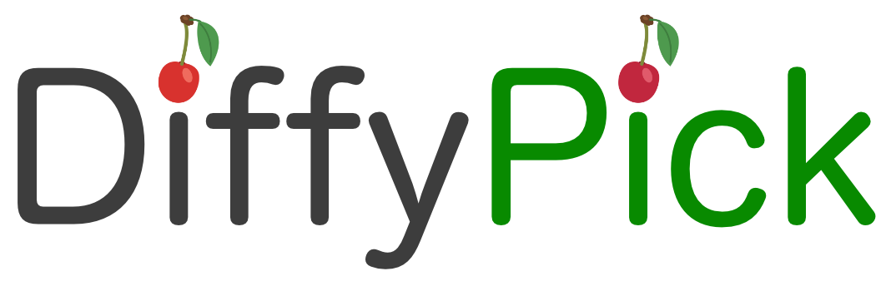
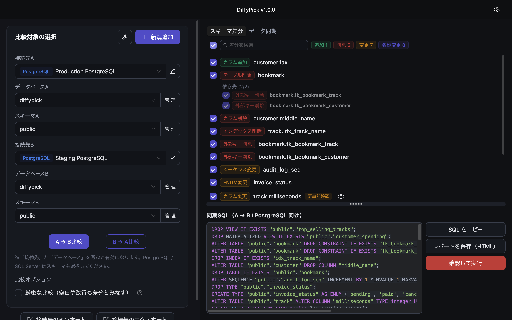

  <picture>
    <source media="(prefers-color-scheme: dark)" srcset="assets/logo-dark.png">
    
  </picture>

  <strong>DB の「何が変わったんだっけ」を、終わりにしよう。</strong>

  MySQL / MariaDB / PostgreSQL / SQL Server / SQLite 対応の、ビジュアル スキーマ差分 &amp; 同期デスクトップアプリ。

  <a href="https://diffy-pick.com/ja/"><strong>diffy-pick.com/ja</strong></a> ·
  <a href="../../releases/latest">最新版ダウンロード</a> ·
  <a href="README.md">English</a>

---

## DiffyPick とは？

DiffyPick は 2つのデータベースを比較し、あらゆる差分を色分けされたオブジェクト単位のリストで表示し、そのまま安全に揃えるデスクトップアプリです。FK 順序の自動整列、事前チェック、生成 SQL のプレビュー、ワンクリックバックアップまで内蔵。ローカル / テスト / 本番の比較も、異種 DB 間 (例: MySQL → PostgreSQL) の比較・移行も、1つのウィンドウで完結します。

- **対応 DB**: MySQL / MariaDB / PostgreSQL / SQL Server / SQLite
- **対応 OS**: macOS / Windows (Linux は開発予定)
- **異種 DB 対応**: 任意の 2方言間で構造の比較・移行が可能
- **安全設計**: フェイルクローズドのガードレール、ステートメント単位の実行、バックアップ / リストア内蔵
- **ローカル完結**: スキーマやデータは外部に送信されません (ライセンス認証・更新確認を除く)

  

機能一覧・料金・FAQ・デモ動画は公式サイトを参照してください: **[diffy-pick.com/ja](https://diffy-pick.com/ja/)**

## このリポジトリについて

DiffyPick の **配布専用** リポジトリです。以下のみを提供します:

- macOS / Windows (今後追加予定の OS も含む) 向けの **リリースバイナリ** — [Releases](../../releases) ページ
- アプリが起動時に参照する **自動アップデート フィード**

DiffyPick 本体は **クローズドソースの商用アプリ** です。ソースコードは本リポジトリを含めどこにも公開されていません。

### リリースページの「Source code (zip/tar.gz)」リンクについて

GitHub の release には仕様上「Source code」アーカイブが自動で付与されますが、その中身は **本リポジトリのファイル (実質この README のみ)** であり、**DiffyPick 本体のソースコードは含まれません**。アプリのインストールには、各 release に添付されたバイナリ資産 (`DiffyPick-*.dmg` / `DiffyPick-*.exe` / `DiffyPick-*.AppImage` 等) を使用してください。

## インストール

1. [最新の release](../../releases/latest) を開く
2. OS に合わせたファイルをダウンロード:
   - **macOS**: `DiffyPick-*.dmg`
   - **Windows**: `DiffyPick-*.exe`
3. インストーラの指示に従うだけです。SQLite はアカウント登録・期限なしで無料利用可能 — 他の DB は必要になってからライセンスを追加できます。

アップデートは起動時にチェックされ、適用のタイミングはあなたが選びます。バックグラウンドで勝手に更新されることはありません。

## サポート・フィードバック

不具合報告・要望・ライセンスに関する問い合わせ: **support@eggletric.com**

## リンク

- **製品サイト**: <https://diffy-pick.com/ja/>
- **開発元 Eggletric**: <https://eggletric.com/>

  

